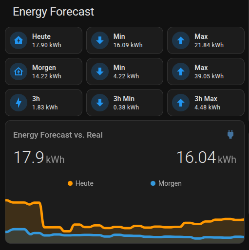
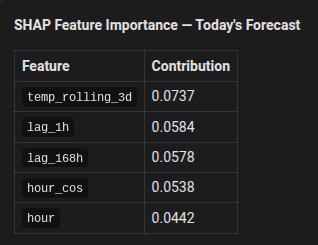
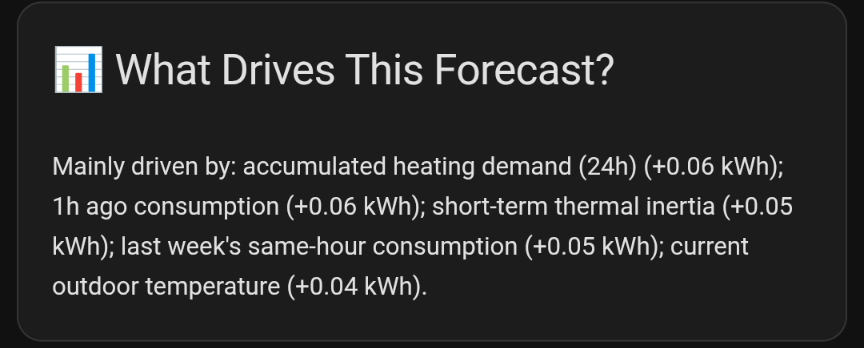
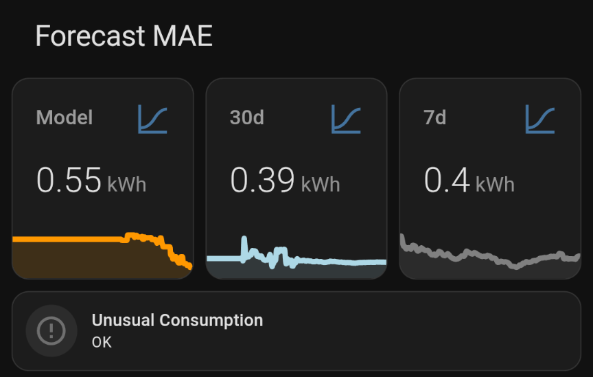

<picture>
  <source media="(prefers-color-scheme: dark)" srcset="assets/energy_forecast_logo_dark.png">
  
</picture>

*Know your electricity bill before the day begins.*


   

Plan EV charging, avoid bill surprises, and know your daily energy use before the day starts — using a two-stage machine-learning model trained on *your own* historical grid-import data and local weather. The system identifies your household's "daily regimes" (e.g. Workday vs. Home Office) to provide a stable baseline, then fine-tunes hourly predictions based on real-time weather and lags.

> **Note:** Designed for Home Assistant power users with a smart meter (`total_increasing` kWh sensor). Requires Home Assistant 2023.x+ and AppDaemon 4.x.

**What you get:**
- Trains entirely on *your* historical grid-import data — no generic model, no cloud dependency
- 48-hour hourly forecast updated every hour, with calibrated prediction intervals
- Anticipates heat-pump and DHW cycles from thermal pressure, outdoor temperature, and physics features
- Scenario "what-if" API: ask what happens if you run the dishwasher at 22:00

---

## Dashboard

| Forecast overview | SHAP feature importance |
|---|---|
|  |  |

The left card shows today/tomorrow forecasts with prediction-interval min/max and the live ApexCharts "Forecast vs. Real" graph. The right card shows the SHAP feature importance table (rendered via native Lovelace Jinja2 — no custom cards needed).

| What drives today's forecast | MAE & anomaly detection |
|---|---|
|  |  |

Left: SHAP narrative card explaining the top drivers of today's forecast (e.g. "Mainly driven by: daily regime pattern; yesterday's same-hour consumption"). Right: rolling MAE sensors (model-reported, 30-day, 7-day) alongside the unusual consumption binary sensor.

Dashboard YAML is in `dashboard/`.

---

## Contents

- [Quick Start](#quick-start)
- [Features](#features)
- [Scenario / What-If API](#scenario--what-if-api)
- [Requirements](#requirements)
- [Installation](#installation)
- [Configuration](#configuration)
- [Published sensors](#published-sensors)
- [How it works](#how-it-works)
- [Backfilling history](#backfilling-history)
- [Weather sources](#weather-sources)
- [EV charging detection](#ev-charging-detection)
- [Solar PV + battery](#solar-pv--battery)
- [Sub-energy sensors](#sub-energy-sensors)
- [Daily Regime Clustering](#daily-regime-clustering-optional)
- [Vacation / Away mode](#vacation--away-mode)
- [Occupancy / Presence](#occupancy--presence)
- [Baseline / Passive mode](#baseline--passive-mode)
- [Thermal & DHW modeling](#thermal--dhw-modeling)
- [MQTT Discovery](#mqtt-discovery-optional)
- [Dashboard Setup](#dashboard-setup)
- [Troubleshooting](#troubleshooting)
- [Security notes](#security-notes)
- [Licence](#licence)

---

## Quick Start

These four steps get forecasts running. Skip MQTT Discovery, sub-sensors, and backfill for now — link to each is in the relevant section.

**Before you start:**
1. Find your `energy_sensor` entity ID: go to **Developer Tools → States**, filter by `energy` or `kwh`, and look for a sensor whose state increases continuously (never resets daily). Note the full entity ID.
2. Note your home's latitude and longitude in decimal degrees (e.g. from Google Maps).

**1. Install AppDaemon and configure dependencies.**
In HA go to **Settings → Add-ons → Add-on Store**, install **AppDaemon**, then paste the dependency block from [Requirements → AppDaemon add-on configuration](#appdaemon-add-on-configuration) into the add-on's Configuration tab and save.

> **Timing:** the first AppDaemon restart takes **5–10 minutes** while LightGBM compiles on some platforms. Subsequent restarts take ~30 seconds (wheel is cached). On **Raspberry Pi (armv7)**, omit the `lightgbm` `init_commands` line if compilation fails — the app falls back to scikit-learn automatically.

**2. Copy the app files** into your AppDaemon apps directory:
```
<config>/appdaemon/apps/
├── apps.yaml                    ← create in step 3
└── energy_forecast/
    ├── __init__.py
    ├── energy_forecast.py
    ├── ha_data.py
    ├── model.py
    ├── weather.py
    └── const.py
```

**3. Create `apps.yaml`** from the example and set the three required keys:
```bash
cp apps/apps.yaml.example /config/appdaemon/apps/apps.yaml
```
Open the file and fill in `energy_sensor`, `latitude`, and `longitude`. This file stays in place permanently — it is your live configuration.

**4. Restart AppDaemon.** Watch the log for:
```
HA Energy Forecast ready.
```
Within a minute, `sensor.energy_forecast_setup_status` will read `ok` and forecasts will begin publishing.

**Next steps:**
1. **Import dashboard cards** — YAML files are in `dashboard/`. See [Dashboard Setup](#dashboard-setup) for required custom cards.
2. **Run backfill if you have < 48 hours of history** — see [Backfilling history](#backfilling-history). New installs without backfill will not produce a forecast until 48 hours of data accumulate.
3. **Wait 48 hours for the first stable forecast.** Accuracy improves significantly over 2–4 weeks as lag features activate and the model learns your household's weekly rhythm.

---

## Features

### Stage 1 — Core Forecasting
- **48-hour hourly forecast** — trained on your own consumption history, not generic averages
- **LightGBM with scikit-learn GBR fallback** — works on any hardware including armv7 Raspberry Pi (automatic fallback when no C compiler is available)
- **SHAP feature importance** — `shap_top_features` attribute and `shap_narrative` text on `sensor.energy_forecast_today` explain which inputs drove today's forecast
- **Anomaly detection** — `binary_sensor.energy_forecast_unusual_consumption` fires when actual usage deviates by more than σ from the day-ahead prediction
- **Live rolling MAE** — `sensor.energy_forecast_mae_7d` and `mae_30d` track real-world accuracy with calibrated 80% prediction intervals
- **High-resolution local weather** — SRG-SSR forecast (Switzerland) with automatic Open-Meteo fallback
- **EV charging detection** — EV sessions subtracted from the training signal; detected kWh published as separate sensors
- **Solar PV + battery support** — four optional sensors correct the training target to true household consumption
- **Exponential sample weighting** — recent data influences the model more than old data
- **Self-healing** — graceful fallbacks at every external dependency

### Stage 2 — Thermal & Occupancy
- **Thermal & DHW intent modeling** — climate setpoint/current-temperature delta (`thermal_pressure`) and DHW buffer temperature (`dhw_pressure`) let the model anticipate heat-pump and water-heater cycles before they start
- **Physics feature pack** — `infiltration_pressure` (wind × thermal gradient), `defrost_risk` (humidity-scaled heat-pump defrost proxy), `thermal_pressure_net` (pressure minus passive solar gain)
- **Thermal setpoint projection** — outdoor-temperature hysteresis projects heating on/off transitions across the full 48-hour window, eliminating step discontinuities in `thermal_pressure`
- **Occupancy detection** — optional `people_home` person-count feature improves accuracy during home/away transitions
- **Vacation / away mode** — `is_away` flag teaches the model lower holiday consumption

### Stage 3 — Appliance Learning
- **Appliance-level context** — optional `sub_energy_sensors` give the model lag, activity, and run-count features per appliance
- **ML appliance signatures** — learned per-appliance 4-hour energy profiles, used by the scenario API
- **Passive / Baseline mode** — strips controllable sub-sensor loads from the training target for cleaner baseline accuracy and meaningful scenario deltas

### Stage 4 — Scenario API & Regime Clustering
- **Scenario / What-If API** — ask "what if I run the dishwasher at 22:00?" without changing the live forecast; results fire an HA event and optionally publish dedicated sensors
- **Daily Regime Clustering** (optional) — clusters historical 24-hour profiles into typical patterns (e.g. Workday, Weekend, High-Heating) and predicts the most likely regime for tomorrow; provides the model with a stable `regime_kwh` prior
- **MQTT Discovery** (optional) — registers all sensors in the HA entity registry for area assignment, labels, and UI renaming

---

## Scenario / What-If API

Call the `energy_forecast/get_scenario` AppDaemon service to overlay appliance run schedules onto the current 48-hour baseline forecast.

**Service call (YAML):**
```yaml
service: appdaemon/energy_forecast_get_scenario
data:
  schedule:
    sub_dishwasher: "22:30"        # key = entity ID suffix from sub_energy_sensors
    sub_washing_machine: "off"     # "off" or null to exclude from scenario
  publish: true                    # optional: write result to HA sensors
```

Schedule dict keys are the suffix of the `sub_energy_sensors` entity ID after the last `.`, e.g. `sub_dishwasher` from `sensor.dishwasher_energy_kwh`. Alternatively, pass the full entity ID. Unknown keys are silently skipped.

**Event payload** (`energy_forecast_scenario_result`):
```json
{
  "forecast": [
    {"timestamp": "2024-06-01T00:00:00+02:00", "predicted_kwh": 0.42, "delta_kwh": 0.0},
    {"timestamp": "2024-06-01T01:00:00+02:00", "predicted_kwh": 0.38, "delta_kwh": 0.0},
    "..."
  ]
}
```

`timestamp` is in your configured timezone (ISO 8601 with UTC offset). `delta_kwh` is the net addition from scheduled appliances relative to the baseline forecast — positive values mean higher consumption than baseline.

**Published sensors** (when `publish: true`):

| Entity ID | Description |
|-----------|-------------|
| `sensor.energy_forecast_scenario_today` | Total scenario consumption today (kWh) |
| `sensor.energy_forecast_scenario_tomorrow` | Total scenario consumption tomorrow (kWh) |
| `sensor.energy_forecast_scenario_delta_today` | Appliance-induced delta vs baseline today (kWh) |
| `sensor.energy_forecast_scenario_today_00_03` … `_21_24` | 8 × 3-hour block sensors for today (kWh) |

All sensors carry `unit_of_measurement: kWh`. Invalid or unknown schedule entries are silently skipped.

---

## Requirements

**Home Assistant 2023.x+ · AppDaemon 4.x**

### Home Assistant side
- Home Assistant with a cumulative grid-import energy sensor (`state_class: total_increasing`, unit `kWh`)
- [AppDaemon 4.x](https://github.com/AppDaemon/appdaemon) installed as an HA add-on or standalone

### AppDaemon add-on configuration
The HA AppDaemon add-on does **not** read `requirements.txt`. Dependencies must be declared in the add-on's own configuration, edited via **Settings → Add-ons → AppDaemon → Configuration** in the HA UI:

```yaml
system_packages:
  - build-base
  - gfortran
  - openblas-dev
  - python3-dev
python_packages:
  - requests>=2.31.0
  - holidays>=0.46
init_commands:
  - "pip install --extra-index-url https://alpine-wheels.github.io/index pandas numpy 'scikit-learn<=1.6.0'"
  - "mkdir -p /data/pip_cache && pip install --cache-dir /data/pip_cache lightgbm --quiet"
```

`system_packages` provides the Alpine build toolchain (needed to compile LightGBM from source) plus the `libgomp` OpenMP runtime required by scikit-learn. `python_packages` handles pure-Python packages.

**Why `init_commands` instead of `python_packages` for pandas/numpy/scikit-learn?** AppDaemon runs on Alpine Linux (musl libc). PyPI and the HA musllinux-index do not provide pre-built musl wheels for these packages on aarch64 — pip would fall back to a source build (very slow). The alpine-wheels index provides pre-built musl-compatible wheels. LightGBM must be compiled from source; the add-on's `/data/` volume cache means it compiles once (**~5 min on first restart**) and reuses the wheel on every subsequent start (**~30 sec**).

> **Important:** each `init_commands` entry must be a **separate list item**. A single `>-` folded scalar merges all lines into one string, which can pass package names as stray tokens to an earlier pip command.

> **Note:** If LightGBM fails to build on your platform (e.g. armv7 without a C compiler), remove the second `init_commands` entry and the build toolchain from `system_packages` — but keep `libgomp`, which scikit-learn requires at runtime on Alpine/aarch64:
> ```yaml
> system_packages:
>   - libgomp
> python_packages:
>   - requests>=2.31.0
>   - holidays>=0.46
> init_commands:
>   - "pip install --extra-index-url https://alpine-wheels.github.io/index pandas numpy 'scikit-learn<=1.6.0'"
> ```
> The app will automatically fall back to scikit-learn's GradientBoostingRegressor. Removing `libgomp` causes scikit-learn to fail to import even though it installs without error (issue [#10](https://github.com/m-zenker/ha-energy-forecast/issues/10)).

This configuration is also available as [`ha_appdaemon_config.yaml`](ha_appdaemon_config.yaml) in the repository root — copy either source.

### Python packages reference

| Package | Notes |
|---------|-------|
| `pandas` ≥ 2.0.0 | |
| `numpy` ≥ 1.24.0 | |
| `requests` ≥ 2.31.0 | |
| `holidays` ≥ 0.46 | Swiss public holiday feature |
| `scikit-learn` ≥ 1.4.0 | Required — GBR fallback engine + Daily Regime Clustering |
| `lightgbm` ≥ 4.0.0 | Optional — primary engine |

---

## Installation

1. **Install the AppDaemon add-on** if you haven't already:
   - Go to **Settings → Add-ons → Add-on Store**, search for **AppDaemon**, install and start it.
   - Configure dependencies as shown in the [Requirements](#appdaemon-add-on-configuration) section above, then restart the add-on.

2. **Copy the app** into your AppDaemon apps directory so the structure looks like this:
   ```
   <config>/
   └── appdaemon/
       └── apps/
           ├── apps.yaml                    ← create from apps.yaml.example
           └── energy_forecast/
               ├── __init__.py
               ├── energy_forecast.py
               ├── ha_data.py
               ├── model.py
               ├── weather.py
               └── const.py
   ```

3. **Create `apps.yaml`** from the provided example and keep it in place permanently — it is your live configuration:
   ```bash
   cp apps/apps.yaml.example /config/appdaemon/apps/apps.yaml
   ```
   Then edit it with your values (see [Configuration](#configuration) below).

   > **Warning:** `apps.yaml` is **gitignored** in this repo because it contains API credentials. Never commit it.

4. **Restart AppDaemon.** The add-on will run the `init_commands` to install dependencies, then start the app. Watch the AppDaemon log for:
   ```
   HA Energy Forecast initialising…
   ML engine: LightGBM
   Config validated — lat=…
   HA Energy Forecast ready.
   ```

5. **Initial training** runs ~10 seconds after startup. If you have fewer than 48 hours of history the app will log a warning and skip training until more data accumulates. See [Backfilling history](#backfilling-history) to import years of history from the HA SQLite database.

   **Verify it's working:** after ~2 minutes, check `sensor.energy_forecast_setup_status` in **Developer Tools → States** — it should read `ok`. See also the [Troubleshooting quick sanity check](#troubleshooting).

---

## Configuration

All configuration lives in `apps.yaml`. Copy `apps/apps.yaml.example` as your starting point.

```yaml
energy_forecast:
  module: energy_forecast.energy_forecast
  class: EnergyForecast

  # ── Required ──────────────────────────────────────────────────────────────
  energy_sensor: sensor.your_grid_import_sensor
  latitude: 47.0     # decimal degrees
  longitude: 8.0     # decimal degrees

  # ── SRG-SSR weather API (optional) ───────────────────────────────────────
  # High-quality Swiss forecast. If omitted, Open-Meteo is used instead.
  # Obtain credentials free at https://developer.srgssr.ch
  # The nearest weather station is resolved automatically from latitude/longitude.
  # srg_client_id: YOUR_CLIENT_ID
  # srg_client_secret: YOUR_CLIENT_SECRET

  # ── Optional ──────────────────────────────────────────────────────────────
  # outdoor_temp_sensor: sensor.outdoor_temperature
  timezone: Europe/Zurich

  # Exponential sample weight half-life in days (default: 90).
  # Lower = recent data weighted more heavily. 0 = disable weighting.
  weight_halflife_days: 90

  # EV charging detection thresholds (defaults shown).
  # ev_charging_threshold_kwh: 7    # hours above this are classified as EV
  # ev_charger_kw: 9.0              # fixed charger load subtracted from those hours

  # Solar PV + battery target correction (optional).
  # Corrects the training target from grid-import-only to true household consumption.
  # Any subset of the four sensors may be configured independently.
  # solar_production_sensor:  sensor.solaredge_ac_energy_kwh
  # grid_export_sensor:       sensor.solaredge_exported_energy_kwh
  # battery_charge_sensor:    sensor.solaredge_battery_charge_kwh
  # battery_discharge_sensor: sensor.solaredge_battery_discharge_kwh

  # Path override for the energy history CSV (default: next to energy_forecast.py).
  # cache_path: /config/appdaemon/apps/energy_forecast/energy_history.csv

  # Optional: cumulative kWh sub-sensors tracked as lag features (see below).
  # sub_energy_sensors:
  #   - sensor.heat_pump_energy_kwh
  #   - sensor.dishwasher_energy_kwh

  # Daily Regime Clustering (optional, requires scikit-learn).
  # enable_regimes: true
  # regime_count: 5

  # Vacation / away mode (optional).
  # away_mode_entity: input_boolean.vacation_mode
  # away_return_entity: input_datetime.vacation_return

  # Anomaly detection threshold (optional, default: 3.0).
  # binary_sensor.energy_forecast_unusual_consumption fires when the latest
  # actual consumption deviates more than this many std-deviations from the
  # day-ahead prediction. Requires ≥10 matched hours (cold-start safe).
  # anomaly_sigma_threshold: 3.0

  # SHAP feature importance (optional, default: 5).
  # Top-N driving features exposed as shap_top_features attribute on
  # sensor.energy_forecast_today. Set to 0 to disable.
  # shap_top_n: 5

  # Thermal setpoint projection — hysteresis thresholds (optional).
  # Controls when heating is projected on/off across the 48h forecast window.
  # heating_temp_on:      14.0   # outdoor °C below which heating is projected ON
  # heating_temp_off:     18.0   # outdoor °C above which heating is projected OFF
  # heating_setpoint_on:  20.0   # climate setpoint (°C) used when heating is ON
  # heating_setpoint_off: 12.0   # climate setpoint (°C) used when heating is OFF
```

> **Note:** To find your `energy_sensor` entity ID, go to **Developer Tools → States**, filter by `energy` or `kwh`, and look for your grid-import meter — a sensor whose state increases continuously and never resets to zero each day.

### Parameter reference

| Parameter | Required | Default | Description |
|-----------|----------|---------|-------------|
| `energy_sensor` | Yes | — | Entity ID of your cumulative grid-import kWh meter (`state_class: total_increasing`) |
| `latitude` | Yes | — | Home latitude in decimal degrees |
| `longitude` | Yes | — | Home longitude in decimal degrees |
| `srg_client_id` | No | — | SRG-SSR API client ID. If absent, Open-Meteo is used |
| `srg_client_secret` | No | — | SRG-SSR API client secret |
| `outdoor_temp_sensor` | No | — | Entity ID of an outdoor temperature sensor. Blended with forecast for hours 0–6 |
| `timezone` | No | `Europe/Zurich` | IANA timezone name |
| `weight_halflife_days` | No | `90` | Sample weight half-life in days. Must be `≥ 1`. Typical range: 60–180 (lower = recent data weighted more heavily). |
| `ev_charging_threshold_kwh` | No | `7` | Hours above this value (kWh/h) are treated as EV charging |
| `ev_charger_kw` | No | `9.0` | Fixed charger power subtracted from EV hours (kW) |
| `solar_production_sensor` | No | — | Entity ID of a cumulative solar production kWh meter (`total_increasing`). Adds solar generation to the training target. See [Solar PV + battery](#solar-pv--battery). |
| `grid_export_sensor` | No | — | Entity ID of a cumulative grid-export kWh meter (`total_increasing`). Subtracts exported energy from the training target. Recommended when solar is configured. |
| `battery_charge_sensor` | No | — | Entity ID of a cumulative battery charge kWh meter (`total_increasing`). Subtracts battery charging from the training target. |
| `battery_discharge_sensor` | No | — | Entity ID of a cumulative battery discharge kWh meter (`total_increasing`). Adds battery discharge back to the training target. |
| `cache_path` | No | Next to `energy_forecast.py` | Override path for the energy history CSV file |
| `holiday_country` | No | `CH` | ISO 3166-1 alpha-2 country code for public holidays (e.g. `DE`, `GB`, `FR`, `US`). Change to match your country — using the wrong country degrades accuracy around holiday periods. |
| `holiday_canton` | No | — | Two-letter Swiss canton code (e.g. `ZH`, `BE`, `GE`). Adds cantonal holidays to the `is_public_holiday` feature in addition to federal ones |
| `adaptive_retrain_threshold` | No | `2.0` | Ratio of live day-ahead MAE to CV MAE that triggers an early retrain. Set to `0` to disable. |
| `sub_energy_sensors` | No | `[]` | List of cumulative kWh sub-sensor entity IDs (heat pump, dishwasher, etc.) to track as `lag_24h`/`lag_168h` features. Must be `total_increasing` kWh meters. See [Sub-energy sensors](#sub-energy-sensors). |
| `enable_regimes` | No | `false` | Enable [Daily Regime Clustering](#daily-regime-clustering-optional). Groups historical 24h profiles and predicts the regime for tomorrow. Requires `scikit-learn`. |
| `regime_count` | No | `5` | Number of distinct daily patterns to identify (e.g. Workday, Weekend, High-Heating). Typical range: 3–7. Set to `0` to enable Auto-K (selects K ∈ [2, 8] via inertia elbow; experimental). |
| `baseline_mode` | No | `false` | When `true`, subtracts all `sub_energy_sensors` from the training target so the model learns the household baseline without controllable-appliance noise. Mirrors the same subtraction at prediction time. See [Baseline / Passive mode](#baseline--passive-mode). |
| `baseline_included_sensors` | No | `[]` | When `baseline_mode: true`, sensors listed here are **kept** in the training target (not subtracted). Use to include heating/DHW sub-sensors in the baseline model while still removing schedulable appliances (dishwasher, washer) for clean scenario deltas. Sensors absent from this list are subtracted as before. |
| `climate_entities` | No | `[]` | List of HA `climate` entity IDs. Used to derive `thermal_pressure` (area-weighted setpoint − current temp, in °C·h). See [Thermal & DHW modeling](#thermal--dhw-modeling). |
| `climate_room_areas` | No | `{}` | Dict mapping `climate` entity IDs to floor areas in m² (e.g. `climate.living_room: 30`). Used to area-weight `thermal_pressure` so larger rooms have more influence. Rooms not listed default to 15 m². |
| `dhw_buffer_sensor` | No | — | Entity ID of a DHW buffer temperature sensor (°C). Used to derive `dhw_pressure`. See [Thermal & DHW modeling](#thermal--dhw-modeling). |
| `heating_system_active_entity` | No | — | Binary sensor or `input_boolean` that is `"on"` only when the heating system is permitted to run (e.g. a Summer Mode switch). Used to isolate passive-cooling windows for τ calibration (log-linear OLS fit on periods where the building decays freely). Enables `thermal_pressure_cop`. Accepts `input_boolean` entities (`"on"`/`"off"` states). |
| `away_mode_entity` | No | — | Entity ID of a boolean entity (e.g. `input_boolean.vacation_mode`). When `"on"`, the model learns lower vacation-period consumption from history and predicts accordingly via the `is_away` feature. |
| `away_return_entity` | No | — | Entity ID of a datetime entity (e.g. `input_datetime.vacation_return`). When set, `is_away` flips to 0 at the return hour within the 48-hour forecast window. Requires `away_mode_entity`. |
| `anomaly_sigma_threshold` | No | `3.0` | Std-deviation multiplier for `binary_sensor.energy_forecast_unusual_consumption`. Fires when the latest actual–prediction residual exceeds this multiple of the historical residual std. Must be `> 0`. Typical range: 2.5–4.0. Silent until ≥ 10 matched hours accumulate. |
| `shap_top_n` | No | `5` | Number of top SHAP features exposed as `shap_top_features` attribute on `sensor.energy_forecast_today`. Set to `0` to disable. |
| `presence_sensors` | No | `[]` | List of Home Assistant `person` or `device_tracker` entities used for occupancy counting (`people_home` feature). |
| `model_archive_count` | No | `3` | Number of previous model snapshots to keep in `models/archive/` for rollback. Set to `0` to disable model versioning. Rollback via HA event `energy_forecast_rollback_model` or dashboard. |
| `mqtt_discovery` | No | `false` | Enable MQTT Discovery mode. Registers all sensors in the HA entity registry (area assignment, labels). Requires a running MQTT broker and the AppDaemon MQTT plugin. See [MQTT Discovery](#mqtt-discovery-optional) |
| `mqtt_namespace` | No | `mqtt` | AppDaemon MQTT plugin namespace. Must match the `namespace:` key in the MQTT plugin block of `appdaemon.yaml` |
| `mqtt_discovery_prefix` | No | `homeassistant` | HA MQTT discovery prefix. Change only if your HA instance uses a non-default discovery prefix |
| `heating_temp_on` | No | `14.0` | Outdoor temperature threshold (°C) below which heating is projected ON across the 48h window. Used by `_build_heating_active_projection()`. Requires `heating_system_active_entity`. |
| `heating_temp_off` | No | `18.0` | Outdoor temperature threshold (°C) above which heating is projected OFF. Dead-band between `heating_temp_on` and `heating_temp_off` holds the current heating state. |
| `heating_setpoint_on` | No | `20.0` | Climate setpoint (°C) projected when heating is ON. Used to compute `thermal_pressure` for future hours. |
| `heating_setpoint_off` | No | `12.0` | Climate setpoint (°C) projected when heating is OFF (e.g. night/summer setback). |

**`sub_energy_sensors` — dict form with `program_sensor`:**

Each entry in `sub_energy_sensors` may be either a plain entity ID string or a dict with an optional `program_sensor` sub-key:

```yaml
sub_energy_sensors:
  - sensor.heat_pump_energy_kwh          # simple string form
  - entity_id: sensor.dishwasher_energy_kwh
    program_sensor: sensor.dishwasher_selected_program   # learn per-program energy profiles
```

The `program_sensor` sub-key enables per-program appliance signatures (requires ≥ 2 recorded cycles per program). Omitting it uses a single aggregate signature for that appliance.

---

## Published sensors

After install you will see sensors in **Developer Tools → States** under the `sensor.energy_forecast_*` prefix. With [MQTT Discovery](#mqtt-discovery-optional) enabled they appear as a single **HA Energy Forecast** device in the entity registry.

All sensors have `unit_of_measurement: kWh` and carry `attribution`, `model_engine`, and `last_trained` attributes.

> **Note — MQTT Discovery entity IDs:** When `mqtt_discovery: true` is set, Home Assistant
> creates entities under the device "HA Energy Forecast". Entity IDs take the form
> `sensor.ha_energy_forecast_<unique_id>` (e.g. `sensor.ha_energy_forecast_energy_forecast_today`).
> Block forecast sensors use `HH_MM_HH_MM` format for time slots (e.g. `sensor.ha_energy_forecast_energy_forecast_today_06_00_09_00` for 06:00–09:00).
> The `sensor.energy_forecast_*` IDs in the table below reflect the `set_state()` path; update
> any automations accordingly when switching modes.

### Forecast totals

| Entity ID | Description |
|-----------|-------------|
| `sensor.energy_forecast_next_1h` | Predicted consumption for the next hour |
| `sensor.energy_forecast_next_3h` | Predicted consumption for the next 3 hours |
| `sensor.energy_forecast_today` | Total for today (midnight to midnight): actuals for elapsed hours + forecast for remaining hours. Attributes: `shap_top_features` (top driving features) and `shap_narrative` (human-readable explanation, e.g. "Mainly driven by: current outdoor temperature; yesterday's same-hour consumption"). |
| `sensor.energy_forecast_tomorrow` | Predicted total for tomorrow |

### Prediction intervals (calibrated 80% coverage)

Published once quantile models are trained (first retrain cycle after install).
Intervals are calibrated via split conformal prediction (CQR): q10/q90 quantile models are
trained on the first 85% of history; the remaining 15% serves as a held-out calibration set
that derives an additive log-space correction `q_hat` ensuring ≥80% marginal coverage.
Elapsed hours use actuals for both bounds; the interval applies only to the forecast portion.

| Entity ID | Description |
|-----------|-------------|
| `sensor.energy_forecast_next_3h_low` | 10th-percentile forecast for the next 3 hours |
| `sensor.energy_forecast_next_3h_high` | 90th-percentile forecast for the next 3 hours |
| `sensor.energy_forecast_today_low` | 10th-percentile total for today |
| `sensor.energy_forecast_today_high` | 90th-percentile total for today |
| `sensor.energy_forecast_tomorrow_low` | 10th-percentile total for tomorrow |
| `sensor.energy_forecast_tomorrow_high` | 90th-percentile total for tomorrow |

### 3-hour block forecasts

One sensor per 3-hour block, for both today and tomorrow:

| Entity ID pattern | Example | Description |
|-------------------|---------|-------------|
| `sensor.energy_forecast_today_HH_HH` | `sensor.energy_forecast_today_06_09` | Today 06:00–09:00 kWh |
| `sensor.energy_forecast_tomorrow_HH_HH` | `sensor.energy_forecast_tomorrow_18_21` | Tomorrow 18:00–21:00 kWh |

Slots: `00_03`, `03_06`, `06_09`, `09_12`, `12_15`, `15_18`, `18_21`, `21_24` (8 slots × 2 days = 16 sensors)

### EV charging actuals

| Entity ID | Description |
|-----------|-------------|
| `sensor.energy_forecast_ev_today` | EV kWh detected in grid import today |
| `sensor.energy_forecast_ev_yesterday` | EV kWh detected in grid import yesterday |

These sensors carry `ev_threshold_kwh` and `ev_charger_kw` as attributes.

### Model diagnostics

| Entity ID | Description |
|-----------|-------------|
| `sensor.energy_forecast_model_mae` | Model mean absolute error (kWh). Attributes include `cv_mae`, `model_engine`, `last_trained` |
| `sensor.energy_forecast_mae_7d` | Rolling mean absolute error over the last 7 days. Attribute `n_pairs` shows how many prediction–actual pairs were used. State is `"0.0"` until enough history accumulates. |
| `sensor.energy_forecast_mae_30d` | Rolling MAE over the last 30 days (`n_pairs` attribute). Reaches full depth after ~30 days. |
| `sensor.energy_forecast_setup_status` | Setup health check. State is `ok` when all packages loaded correctly, or `missing_packages` when one or more pip packages failed to import. The `missing_packages` attribute lists the affected package names — use it to diagnose install issues directly from **Developer Tools → States** without reading AppDaemon logs. |
| `sensor.energy_forecast_relative_mae_7d` | Rolling relative MAE over the last 7 days (%). Normalized accuracy independent of consumption scale. |
| `sensor.energy_forecast_relative_mae_30d` | Rolling relative MAE over the last 30 days (%). |
| `sensor.energy_forecast_thermal_pressure_net` | Thermal pressure (heat deficit minus solar gain) for the current hour. Unit: °C·m². Attribute: `tau_hours` (building thermal time constant in hours; `null` when uncalibrated). Consumed by `ha-energy-manager` heat pump optimiser. |

### Anomaly detection

| Entity ID | Description |
|-----------|-------------|
| `binary_sensor.energy_forecast_unusual_consumption` | `on` when the latest actual consumption deviates more than `anomaly_sigma_threshold` std-deviations from the stored day-ahead prediction. `off` during cold-start (< 10 matched hours). Attributes: `residual_kwh`, `residual_std_kwh`, `sigma_threshold`, `n_pairs`. |

---

## How it works

### Data pipeline

```
HA get_history()  ──┐
                    ├── _merge_energy_frames() ──► energy_history.csv (cache)
energy_history.csv ─┘         (HA wins on conflict)
        │
        ▼
EV detection  ──► baseline_df (EV hours have charger load subtracted)
        │
        ├── solar/battery correction  [_apply_target_correction, if sensors configured]
        │
        ├── fetch_historical_weather()  [Open-Meteo archive]
        │
        ▼
feature engineering + exponential weighting
        │
        ▼
LightGBM / sklearn GBR  ──► model saved to models/energy_model.pkl
```

LightGBM is the primary engine. On platforms without a C compiler (e.g. armv7 Raspberry Pi), it falls back automatically to scikit-learn's GradientBoostingRegressor, which produces equivalent accuracy.

### Prediction pipeline (hourly)

```
fetch_forecast()  [SRG-SSR → Open-Meteo fallback]
        │
        ├── fetch_recent_energy()  [last 2 days, for lag features]
        │
        ├── live outdoor temp  [blended with forecast for h=0..6]
        │
        ▼
48-hour feature matrix  ──► model.predict()  ──► publish sensors
```

### Schedule

| Event | Timing |
|-------|--------|
| Initial training | ~10 seconds after startup |
| Sensor update | ~2 minutes after startup |
| Retrain | Every 7 days (168 hours) |
| Sensor update | Every hour |
| Adaptive retrain | Any hourly update where live day-ahead MAE exceeds `adaptive_retrain_threshold` × CV MAE (≥ 24 matched pairs required; 24h cooldown between triggers) |

### Features used

| Category | Features |
|----------|----------|
| Calendar | hour, day-of-week, month, season, hour-of-week |
| Cyclical encodings | sin/cos of hour, day-of-week, month, day-of-year (`doy_sin`/`doy_cos`) |
| Horizon | `hours_ahead` (0–47, how far into the future the row is) |
| Weather | temp, precipitation, sunshine, wind, cloud cover, direct solar radiation, heating/cooling degree hours, 3-day rolling temperature anchored in measured data |
| Heating system | `hp_heating_degree` (`max(0, 15 − temp_c)` — HP-calibrated heat demand threshold), `temp_in_neutral_zone` (binary: 1 when 15 ≤ temp_c ≤ 22 °C, i.e. HP dead-band), `heating_active` (seasonal binary flag from `heating_system_active_entity`; defaults to 1) |
| Thermal modelling | `temp_ewma_24h/72h` (thermal mass), `heating_deg_sum_24h/168h` (accumulated heating debt), `temp_delta_1h/24h` (trends), `temp_lag_24h/168h` |
| Thermal & DHW intent | `thermal_pressure` (area-weighted HVAC setpoint − current temp; °C·h), `thermal_pressure_max` (largest per-room deficit), `thermal_pressure_std` (room temperature spread), `thermal_pressure_cop` (deficit scaled by inverse outdoor COP — electrical urgency), `thermal_pressure_net` (thermal pressure reduced by passive solar gain), `weighted_solar_gain` (direct radiation weighted by south-facing half-cosine window), `dhw_pressure` (buffer heat-loss urgency score); all zero when not configured |
| Physics | `humidity` (relative humidity %), `infiltration_pressure` (wind speed × thermal gradient — cold-air infiltration proxy), `defrost_risk` (humidity-scaled Gaussian at +2 °C — heat-pump defrost cycle proxy) |
| Autoregressive lags | `lag_1h`, `lag_2h`, `lag_6h`, `lag_12h` (short horizon); `lag_48h`, `lag_72h` (medium horizon); `lag_24h_tgated`, `lag_168h_tgated`, `lag_336h_tgated` (daily/weekly — temperature-delta gated to prevent over-anchoring to heating-season baselines during warm-season transition) |
| Rolling consumption | 24 h mean, 24 h std, 7-day mean |
| Holidays | Swiss public holiday flag; days to/since nearest holiday (capped at 3); configurable cantonal holidays |
| EV probability | `likely_ev_hour` — binary flag per hour-of-week slot where EV sessions were historically ≥ 15% frequent |
| Daily Regime | `regime_kwh` — expected hourly profile for the predicted daily regime (e.g. Workday, Weekend, High-Heating); provides a stable physics-informed prior |
| Away / vacation | `is_away` — binary flag; 1 during periods when `away_mode_entity` is "on"; teaches the model lower vacation-period consumption |
| Occupancy | `people_home` — integer count of people home (from `presence_sensors`) |

When `sub_energy_sensors` is configured, each sub-sensor adds four features: `lag_24h` (same hour yesterday), `lag_168h` (same hour last week, requires ≥ 268 rows of sub-sensor history), `{prefix}_active_24h` (was the appliance active in the past 24 h?), and `{prefix}_runs_7d` (how many on/off cycles in the past 7 days).

Lag features are dynamically enabled as history grows — short-horizon lags (`lag_1h` etc.) activate at ≥ 101 rows; the full autoregressive feature set is active at ≥ 436 rows (≈ 18 days).

### Model persistence

The trained model and metadata are saved as pickle files in `apps/energy_forecast/models/`. Each file has a SHA-256 sidecar (`.sha256`) for integrity verification. A corrupted or missing sidecar triggers a warning and cold-start retrain.

---

## Operational Characteristics

### Cold-start timeline

All forecast sensors show `unavailable` until at least **100 rows** of hourly energy history have been collected. The full feature set (lag features at 24 h / 48 h / 168 h / 336 h, rolling stats) activates progressively — expect roughly **3 weeks** (~500 rows) before lag features are fully active and predictions stabilise.

### Retraining cadence

The model retrains automatically **once a week** on a fixed timer. Retraining runs in a background thread; predictions continue to use the last-good model throughout. There is no sensor freeze or gap during retraining.

To trigger an immediate retrain without restarting AppDaemon, fire the HA event:

```
event: RELOAD_ENERGY_MODEL
```

### CSV cache

`energy_history.csv` grows at roughly **50 KB/month**. It is automatically compacted (sorted, deduplicated) on each weekly retrain. To force a full re-fetch from the HA database, delete the file — the next retrain will rebuild it from scratch.

### Fallback chain

- **Weather API failure**: if the Open-Meteo request fails, the previous forecast is reused until the next successful fetch.
- **Corrupt model pickle**: if the SHA-256 sidecar check fails at startup, a warning is logged and a cold-start retrain is triggered automatically.

---

## Backfilling history

If you have existing Home Assistant data you want to import before the first training run, use the included backfill tool. It reads directly from the HA SQLite database (no REST API, no token required) and can import up to one year of hourly data.

**1. Add to `apps.yaml` temporarily:**
```yaml
energy_history_backfill:
  module: energy_forecast.energy_history_backfill
  class: EnergyHistoryBackfill
  energy_sensor: sensor.your_grid_import_sensor
  ha_db_path: /homeassistant/home-assistant_v2.db  # adjust path for your setup
```

Common database paths:

| Setup | Path |
|-------|------|
| HAOS add-on | `/homeassistant/home-assistant_v2.db` |
| HAOS (older) | `/config/home-assistant_v2.db` |
| Docker | `/config/home-assistant_v2.db` |

**2. Restart AppDaemon.** Watch the log for:
```
Retrieved N raw statistic rows from DB.
After diff & filtering: N clean hourly rows.
Saved N rows to energy_history.csv (+N rows added). Range: YYYY-MM-DD → YYYY-MM-DD.
Backfill complete — remove 'energy_history_backfill' from apps.yaml and delete energy_history_backfill.py.
```

**3. Remove the backfill entry** from `apps.yaml` and delete `apps/energy_forecast/energy_history_backfill.py` from your AppDaemon apps directory. The main app will now have a full training set.

> **Note:** The backfill tool requires the energy sensor to have `state_class: total_increasing` and to have been tracked by the HA recorder. The `statistics` table (never purged by HA) is used — not the short-lived `states` table.

---

## Weather sources

| Source | Used for | Requires |
|--------|----------|----------|
| [Open-Meteo Archive](https://open-meteo.com/) | Historical weather for training | Nothing (free, no key) |
| [SRG-SSR Forecast API](https://developer.srgssr.ch) | 7-day hourly forecast | Free API key |
| [Open-Meteo Forecast](https://open-meteo.com/) | Forecast fallback | Nothing (free, no key) |

Both SRG-SSR and Open-Meteo provide temperature, precipitation, sunshine, and wind data. SRG-SSR offers higher spatial resolution for Swiss locations. When SRG-SSR credentials are configured, the app resolves the nearest weather station from your `latitude`/`longitude` (via the v2 `/geolocations` endpoint), then fetches a 7-day hourly forecast from `/forecastpoint/{id}`. Open-Meteo is supplemented for cloud cover and direct radiation, and to anchor the 3-day rolling temperature feature with measured history. If credentials are not configured, or if any SRG-SSR request fails, Open-Meteo is used automatically — the app will never fail to produce a forecast due to a weather API issue.

---

## EV charging detection

Any hour where gross grid import exceeds `ev_charging_threshold_kwh` (default 7 kWh/h) is classified as an EV charging session. The fixed charger load (`ev_charger_kw`, default 9 kW) is subtracted from those hours before training, leaving the concurrent household baseline (lighting, cooking, etc.) intact.

This means the model trains on the true household signal even on days with EV sessions. The raw detected EV kWh are published separately as `sensor.energy_forecast_ev_today` and `sensor.energy_forecast_ev_yesterday`.

Tune the threshold in `apps.yaml` to match your charger and household ceiling. The default 7 kWh/h suits a 9–11 kW charger with a household ceiling below 6.5 kWh/h.

---

## Solar PV + battery

If your home has solar panels and/or a home battery, the raw grid-import sensor understates true household consumption — solar self-consumption and battery cycling are invisible to the meter. The four optional sensors below correct the training target so the model learns actual household energy use, not just grid draw:

```
total_consumption = grid_import − grid_export
                    + solar_production
                    − battery_charge + battery_discharge
```

Any subset can be configured — e.g. solar-only without a battery, or just `grid_export_sensor` to cancel self-consumption. Sensors not configured are treated as zero.

**Sensor requirements:** all sensors must be *cumulative* kWh entities (`device_class: energy`, `state_class: total_increasing`). If your inverter only exposes instantaneous power (W or kW), create a **Riemann sum integration helper** in HA first (**Settings → Helpers → Add helper → Riemann sum integral**).

### Hardware examples

**SolarEdge Modbus Multi** (entity names are user-defined in the integration):
```yaml
solar_production_sensor:  sensor.solaredge_ac_energy_kwh
grid_export_sensor:       sensor.solaredge_exported_energy_kwh
battery_charge_sensor:    sensor.solaredge_battery_charge_kwh    # may need Riemann sum
battery_discharge_sensor: sensor.solaredge_battery_discharge_kwh
```

**Enphase Envoy** (replace `SERIAL` with your gateway serial number):
```yaml
solar_production_sensor:  sensor.envoy_SERIAL_lifetime_energy_production
grid_export_sensor:       sensor.envoy_SERIAL_lifetime_net_energy_production
battery_charge_sensor:    sensor.envoy_SERIAL_lifetime_battery_energy_charged
battery_discharge_sensor: sensor.envoy_SERIAL_lifetime_battery_energy_discharged
```

**Backward compatibility:** Omitting all four keys produces no behaviour change. The feature activates only for sensors that are explicitly configured.

---

## Sub-energy sensors

The optional `sub_energy_sensors` list lets you give the model appliance-level context — instead of seeing only the aggregate grid import, it can also see how much the heat pump or dishwasher consumed at the same hour yesterday and last week.

```yaml
sub_energy_sensors:
  - sensor.heat_pump_energy_kwh
  - sensor.dishwasher_energy_kwh
```

For each sensor the model gains four features:

| Feature | Value | Activation |
|---------|-------|------------|
| `sub_<name>_lag_24h` | kWh consumed at the same hour yesterday | always |
| `sub_<name>_lag_168h` | kWh consumed at the same hour last week | ≥ 268 h of sub-sensor history |
| `sub_<name>_active_24h` | 1 if the appliance had any non-zero reading in the past 24 h, else 0 | always |
| `sub_<name>_runs_7d` | Number of on/off cycles (0 → >0 transitions) in the past 7 days | always |

**Requirements:**
- The sensor must be a `total_increasing` cumulative kWh meter (same type as `energy_sensor`). Power sensors (W or kW) must first be integrated into a kWh template helper in HA.
- Hours when the appliance is off appear as 0 kWh (not excluded), so the model correctly learns that a zero-lag means the appliance was idle.
- Each sub-sensor gets its own CSV cache file (`sub_<name>.csv`) in the same directory as the main energy cache.

**How many sensors?** 3–5 is a practical limit — each sensor adds 2 feature columns and a separate HA history fetch on every retrain and hourly update.

**Backward compatibility:** Omitting `sub_energy_sensors` (or leaving it commented out) produces no behaviour change. Old model files without sub-sensor features load cleanly and continue to work.

---

## Daily Regime Clustering (optional)

Daily Regime Clustering explicitly extracts 24-hour energy consumption patterns (regimes) and uses them as a stable baseline for the hourly model. This is especially useful for homes with distinct routines (e.g., Workday vs. Home Office vs. Weekend).

### Configuration

Add the following to `apps.yaml` (requires `scikit-learn`):

```yaml
  enable_regimes: true   # default: false
  regime_count: 5        # default: 5
```

### How it works

1.  **Clustering**: The system takes your historical 24-hour consumption profiles — with EV charging hours removed — and groups them into $K$ regimes using K-Means. Using EV-subtracted data ensures regimes capture genuine household shape patterns (workday rhythm, weekend rhythm, high-heating days) rather than EV session timing.
2.  **Regime Predictor**: A secondary classifier is trained to predict which regime a given day belongs to, based on the **weather forecast** and the **calendar**.
3.  **Feature Integration**: For the 48-hour forecast, the system predicts the regime for "Today" and "Tomorrow" and passes the expected 24-hour profile as a strong hint (`regime_kwh`) to the main forecast model.

**Dependency Note:** This feature requires `scikit-learn`. If the package is missing or the feature is disabled, the system falls back gracefully to standard hourly forecasting without any characteristically different behaviour.

### Auto-K (automatic cluster count)

Set `regime_count: 0` to let the system pick the number of regimes automatically:

```yaml
  enable_regimes: true
  regime_count: 0   # auto-select K ∈ [2, 8] via inertia elbow (experimental)
```

**How it works:** The system fits K-Means at each K from 2 to 8 and picks the K where the marginal inertia drop is steepest (the "elbow"). The RegimePredictor OOB accuracy is logged as an informational metric but does not influence the selection. Falls back to K=2 when fewer than 14 days of history are available.

**When to use it:** Homes with an irregular or evolving routine benefit from Auto-K — the system discovers the right number of patterns rather than over- or under-clustering. For stable, well-understood routines, a fixed `regime_count` is still preferable as it gives you direct control.

---

## Vacation / Away mode

When you go on holiday your household consumption drops significantly — the model would otherwise see those low-consumption days as noise and regress toward them over time. The vacation/away feature teaches the model that these are distinct conditions by adding an `is_away` binary flag to every training row and every prediction row.

### Configuration

Add the optional keys to `apps.yaml`:

```yaml
  # Vacation / away mode (optional).
  away_mode_entity: input_boolean.vacation_mode
  away_return_entity: input_datetime.vacation_return   # optional; requires away_mode_entity
```

| Key | Required | Description |
|-----|----------|-------------|
| `away_mode_entity` | No | Entity ID of a `input_boolean` (or any boolean-like entity). When its state is `"on"`, `is_away` is set to 1 for training rows and prediction rows alike. |
| `away_return_entity` | No | Entity ID of an `input_datetime`. When set, `is_away` flips back to 0 at the configured return hour within the 48-hour forecast window. Requires `away_mode_entity`. |

### How it works

- During training, every historical hour when `away_mode_entity` was `"on"` is labelled `is_away = 1`. The model learns that those hours have characteristically lower consumption.
- During prediction, if `away_mode_entity` is currently `"on"`, all 48 forecast hours are initially marked `is_away = 1`.
- If `away_return_entity` is also set and contains a valid future datetime within the 48-hour window, the hours from the return time onward are flipped back to `is_away = 0` — so the forecast transitions from vacation-level to normal consumption at the expected return hour.

**Backward compatibility:** Omitting both keys (or leaving them commented out) produces no behaviour change — `is_away` defaults to 0 for all rows and the model behaves identically to prior versions.

---

## Occupancy / Presence

The occupancy feature improves forecast accuracy by counting how many people are currently at home. This allows the model to learn consumption patterns correlated with household presence (e.g. lighting, cooking, or manual HVAC overrides).

### Configuration

Add the optional `presence_sensors` key to `apps.yaml`. It accepts a list of Home Assistant `person` or `device_tracker` entities:

```yaml
  # Occupancy / Presence (optional).
  presence_sensors:
    - person.alice
    - person.bob
    - device_tracker.guest_phone
```

### How it works

- **State counting**: At each hour, the app checks the state of every entity in `presence_sensors`. Any entity in the `"home"` state adds 1 to the `people_home` feature. All other states (including `unavailable` or `unknown`) add 0.
- **Training**: The app fetches up to 30 days of historical state for these entities to build the `people_home` training column.
- **Prediction**: For the 48-hour forecast window, the current occupancy count is held constant (broadcast) across all future hours. The model uses this to adjust its baseline prediction.

---

## Baseline / Passive mode

When `baseline_mode: true` is set, the model trains on and predicts only the *household baseline* — total consumption minus all `sub_energy_sensors`. This removes the stochastic noise of controllable appliances (dishwasher, washing machine, etc.) from the training signal, which typically lowers baseline MAE and makes `predict_scenario()` deltas more interpretable (the delta is the *net addition* of a scheduled run, not a difference against a noisy aggregate).

### Configuration

```yaml
  baseline_mode: true      # subtract sub_energy_sensors from target
  sub_energy_sensors:
    - sensor.dishwasher_energy_kwh
    - sensor.washing_machine_energy_kwh
    - sensor.heat_pump_energy_kwh
    - sensor.dhw_energy_kwh
  # Keep heating/DHW in the baseline model; only subtract schedulable appliances:
  baseline_included_sensors:
    - sensor.heat_pump_energy_kwh
    - sensor.dhw_energy_kwh
```

`sub_energy_sensors` must be configured for `baseline_mode` to have any effect. Without sub-sensors the flag is a no-op.

`baseline_included_sensors` (optional) lets you selectively keep certain sub-sensors in the training target. Sensors in this list are **not** subtracted from `gross_kwh`, even when `baseline_mode: true`. This is useful when you want the model to learn heating and DHW patterns (which are well-correlated with weather features) while still removing the stochastic noise of schedulable appliances.

### How it works

- **Training**: each training row's target (`gross_kwh`) has the same-hour sum of all `sub_energy_sensors` subtracted before fitting.
- **Prediction**: the baseline forecast is returned as-is; `predict_scenario()` then *adds* the learned appliance run profile for each scheduled appliance on top.
- **MAE reporting**: `sensor.energy_forecast_model_mae` reflects baseline MAE (lower than gross MAE). Scenario sensors reflect the composite (baseline + appliances) forecast.

**Backward compatibility:** Omitting `baseline_mode` (or setting it to `false`) produces no behaviour change.

---

## Thermal & DHW modeling

Stage 2 adds two intent-driven features that allow the model to anticipate HVAC and domestic hot water heating cycles *before* they start, rather than relying on lagged consumption alone.

| Feature | Source | Description |
|---------|--------|-------------|
| `thermal_pressure` | `climate_entities` | Mean of (setpoint − current temperature) across all configured climate entities. High values indicate the heating system will run soon. 0 when no entities configured. |
| `dhw_pressure` | `dhw_buffer_sensor` | Heat-loss urgency: `1 / (max(0.5, buffer_temp − 40) + 1)²`. Rises steeply as the DHW buffer cools toward the reheat threshold (~40 °C). 0 when not configured. |

Both features are zero-safe — omitting the config keys leaves them at 0 for all rows, producing no behaviour change.

### Configuration

```yaml
  # Stage 2: Thermal & DHW intent (all optional)
  climate_entities:
    - climate.living_room
    - climate.bedroom
  dhw_buffer_sensor: sensor.dhw_buffer_temperature
  heating_system_active_entity: binary_sensor.heating_season  # optional
```

| Key | Required | Description |
|-----|----------|-------------|
| `climate_entities` | No | List of HA `climate` entity IDs. Each entity contributes its `(setpoint − current_temp)` delta to `thermal_pressure`, weighted by `climate_room_areas`. |
| `climate_room_areas` | No | Dict of `entity_id: area_m2`. Rooms not listed default to 15 m². |
| `dhw_buffer_sensor` | No | Entity ID of a temperature sensor measuring the DHW buffer (°C). |
| `heating_system_active_entity` | No | Binary sensor or `input_boolean` that is `"on"` only when the heating system is permitted to run. Used for τ calibration and `thermal_pressure_cop`. |

### How it works

- `ha_data.py` fetches climate and DHW history via `fetch_climate_history()` / `fetch_generic_sensor_history()` at each retrain and caches it alongside the main energy CSV.
- `model.py` merges these time series into the training dataframe and computes `thermal_pressure` and `dhw_pressure` per row before fitting.
- At prediction time the same logic applies to the 48-hour forecast window, using current sensor states.

**Backward compatibility:** All config keys are optional. Omitting them leaves all thermal features at 0 and the model behaves identically to prior versions.

### Advanced thermal features

The following features activate when the corresponding sensors are configured and enough history has accumulated:

| Feature | Requires | Description |
|---------|----------|-------------|
| `thermal_pressure` | `climate_entities` | Area-weighted mean (setpoint − current temp) across all rooms (°C·h). Projects forward using RC-ODE for hours >2h ahead — eliminates the zero-fill problem for distant forecast hours. |
| `thermal_pressure_max` | `climate_entities` | Largest per-room deficit at each hour. Captures the room requiring the most heating even when the average is mild. |
| `thermal_pressure_std` | `climate_entities` (≥2) | Standard deviation of per-room deficits. Non-zero when rooms are at very different temperatures (e.g. one room cold, others warm). |
| `thermal_pressure_cop` | `climate_entities` + `heating_system_active_entity` | `thermal_pressure / COP(T_outdoor)` — expresses the same heating deficit in *electrical urgency*: a 1°C deficit costs ~2× more electricity at −10°C than at +10°C outdoors. Denominator clamped at 0.5. |
| `weighted_solar_gain` | weather (`direct_radiation_wm2`) | Direct radiation weighted by a half-cosine window peaking at 13:00, zero outside 09:00–17:00. Captures south-facing passive solar gain that reduces actual heating demand even when `thermal_pressure` is high. |
| `dhw_pressure` | `dhw_buffer_sensor` | Heat-loss urgency: `1 / (max(0.5, buffer_temp − 40) + 1)²`. Rises steeply as the DHW buffer cools toward its reheat threshold. |

**τ calibration** (building thermal time constant): when `heating_system_active_entity` is configured, the model periodically fits a log-linear OLS on passive-cooling windows (periods where the heating system is confirmed off and indoor temperature decays freely). The resulting τ (hours) scales `thermal_pressure` to express heating urgency in °C/h rather than a static °C delta. τ is persisted in `meta.pkl` and survives AppDaemon restarts; falls back to 24h if calibration fails or `heating_system_active_entity` is absent.

---

## MQTT Discovery (optional)

> **Breaking change — entity ID format:** Enabling MQTT Discovery changes all sensor entity IDs:
> ```
> OLD (set_state mode):  sensor.energy_forecast_today
> NEW (MQTT mode):       sensor.ha_energy_forecast_energy_forecast_today
> ```
> Update all automations, dashboards, and template sensors before enabling. Switching back to `set_state` mode restores the old IDs but leaves the MQTT entities in the entity registry until you delete them manually.

By default the app publishes all sensors via AppDaemon's `set_state()` API, which writes values to the HA **state machine** only. This means sensors appear in **Developer Tools → States** and can be used in dashboards and automations, but they are **not** registered in the **entity registry** — so you cannot assign them to an area, add labels, or rename them from the HA UI.

Enabling MQTT Discovery registers every sensor as a proper HA entity under a single **HA Energy Forecast** device, unlocking:
- Area assignment (persists across restarts)
- Labels and aliases
- UI renaming without breaking automations

### Prerequisites

1. **MQTT broker** — Mosquitto is the standard choice. Install it as an HA add-on via **Settings → Add-ons → Mosquitto broker**.
2. **AppDaemon MQTT plugin** — add the following block to `appdaemon/appdaemon.yaml`:

```yaml
plugins:
  MQTT:
    type: mqtt
    namespace: mqtt
    client_host: 192.168.1.x   # ← your broker IP or hostname
    client_port: 1883
```

> **Note:** If your broker requires authentication add `client_user` and `client_password` to the plugin block. See the [AppDaemon MQTT plugin docs](https://appdaemon.readthedocs.io/en/latest/AD_API_REFERENCE.html#mqtt) for all options.

### Enabling MQTT Discovery

Add these keys to `apps.yaml`:

```yaml
energy_forecast:
  # … existing keys …

  # ── MQTT Discovery ──────────────────────────────────────────────────────
  mqtt_discovery: true
  # mqtt_namespace: mqtt            # must match the namespace in appdaemon.yaml
  # mqtt_discovery_prefix: homeassistant   # change only if HA uses a custom prefix
```

Restart AppDaemon. After a few seconds, the device **HA Energy Forecast** appears in **Settings → Devices & Services → MQTT → Devices**.

### What gets registered

All sensors are registered at startup. The 6 prediction-interval sensors (`*_low` / `*_high`) are registered on the **first hourly update after the quantile models finish training** — typically within an hour of the initial retrain. It is normal for these sensors to be absent for the first ~1 hour after startup.

| Sensor group | Count |
|---|---|
| Forecast totals (`next_1h`, `next_3h`, `today`, `tomorrow`) | 4 |
| 3-hour blocks (today + tomorrow) | 16 |
| EV actuals (`ev_today`, `ev_yesterday`) | 2 |
| Model diagnostics (`mae`, `mae_7d`, `mae_30d`, `relative_mae_7d`, `relative_mae_30d`) | 5 |
| Setup status | 1 |
| Anomaly detection (`unusual_consumption`) | 1 |
| Thermal pressure (`thermal_pressure_net`) | 1 |
| Prediction intervals (`*_low`/`*_high`) | 6 (lazy) |
| **Total** | **36** |

### Availability

When AppDaemon starts it publishes `online` to the availability topic. When AppDaemon stops cleanly, it publishes `offline` and all sensors show **Unavailable** in the HA UI automatically.

### Reverting to set_state() mode

Set `mqtt_discovery: false` (or remove the key). The app reverts to writing directly to the HA state machine. Previously registered MQTT entities remain in the entity registry until you delete them manually from **Settings → Devices & Services → MQTT**.

---

## Dashboard Setup

Dashboard YAML files are in the `dashboard/` directory. To import them into Home Assistant:

1. In HA, go to your dashboard → edit mode → **Add card → Manual**.
2. Paste the contents of the desired YAML file.
3. Edit any entity IDs marked with `# ← EDIT` to match your installation.

**Required custom cards** (install via HACS → Frontend):
- [`custom:mushroom-entity-card`](https://github.com/piitaya/lovelace-mushroom) — compact entity tiles
- [`custom:mini-graph-card`](https://github.com/kalkih/mini-graph-card) — sparkline graphs for MAE and forecast history

> **Note:** `dashboard/dashboard.yaml` contains example personal entity IDs (EV battery, heat pump sensors). Replace these with your own entity IDs before importing.

---

## Troubleshooting

**Quick sanity check:**

| Check | Expected |
|-------|----------|
| `sensor.energy_forecast_setup_status` | `ok` |
| `sensor.energy_forecast_model_mae` | a numeric value (kWh) |
| AppDaemon log | `HA Energy Forecast ready.` |

---

**App starts but sensors are `unavailable` for more than 5 minutes**
- Check the AppDaemon log for `Retraining failed` or `Sensor update failed` errors.
- Verify `energy_sensor` is correct and returns a numeric state.

**`No history found in HA or Cache` error**
- The sensor has no state history in HA and the CSV cache is empty or missing.
- Use the [backfill tool](#backfilling-history) to import history from the HA SQLite DB.

**`Insufficient history (N h). Skipping.`**
- Fewer than 48 hours of data are available. The app will retry on the next training cycle. Normal on a new install — history accumulates automatically.
- **New installs:** run the [backfill tool](#backfilling-history) to import existing HA history before the first training run. Without it, you will not receive a forecast until at least 48 consecutive hours of energy readings have been collected.

**`ML engine: sklearn GBR` instead of LightGBM**
- LightGBM failed to install (no C compiler on the host, e.g. armv7).
- The sklearn fallback is fully functional. If you want LightGBM, ensure the build toolchain system packages are present in the add-on configuration.
- On Alpine ARM without a C compiler: remove `lightgbm` from the `init_commands` line in the add-on configuration to avoid a failed install attempt.

**Forecast accuracy is poor in the first few weeks**
- The model needs at least a few weeks of data to learn daily and weekly patterns. Use the backfill tool to give it a head start.
- Check `sensor.energy_forecast_model_mae` — as a rough guide, MAE below ~15% of your average hourly consumption suggests a well-fitted model. Example: a household averaging 2 kWh/h has a 15% target of 0.3 kWh/h. To compute your baseline: find your daily kWh total (e.g. from `sensor.energy_forecast_today` after a normal day) and divide by 24.
- If `sensor.energy_forecast_setup_status` is `ok` but MAE is stuck high: check the AppDaemon log for `Retraining failed`, verify your `energy_sensor` returns a numeric state, and check that `energy_history.csv` is growing in size.

**DST fall-back warning in the log**
- `DST fall-back: N rows share M duplicate naive timestamp(s) after merge` appears on the last Sunday of October. This is informational — the merge still completes correctly; no action required.

**CSV health check warnings**
- After the weekly retrain or during history merge, you may see `WARNING` logs mentioning:
  - `non-monotonic timestamps` — energy meter readings out of order; usually a sensor reset or time jump.
  - `gap detected` — more than 2 hours between consecutive readings; DST transitions are excluded.
  - `out-of-range gross_kwh` — readings above 50 kWh/h (spike filter should have caught it).
- These are diagnostic only and do not stop training. Common causes: sensor reset, power failure during DST, manual meter restart. Check the timestamps and decide if correcting the CSV cache is necessary.

**`Could not fetch recent actuals for lag features`**
- HA history fetch failed. The sensor update proceeds without lag features; the model fills them with training-set medians.
- Sporadic occurrences (once every few days) are normal — HA sometimes times out on large history fetches. No action required.
- If this appears every hour: check HA recorder configuration and database size. A very large `home-assistant_v2.db` can cause persistent history fetch timeouts.

---

## Security notes

- `apps.yaml` is **gitignored**. Copy from `apps.yaml.example` and fill in credentials locally. Never commit the live file.
- SRG-SSR credentials are optional. If you don't use them, no credentials are needed anywhere.
- The backfill tool accesses the HA SQLite database directly (read-only) — ensure AppDaemon has file read access to the DB path.

---

## Licence

[MIT](LICENSE) © 2026 Martin Zenker
